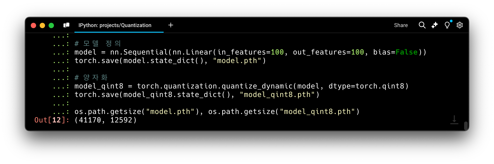

# Quantization, 적용 후 성능 비교하기 (Pytorch, Cifar10)

양자화의 목표는 성능을 유지하면서 모델을 가볍고 빠르게 만드는 것입니다. ~~이걸 왜 안해?~~

필요한 곳
- 빠르다: 빠른 응답이 필요한 곳 (latency를 낮춰야 할 때)
- 가볍다: 모바일 디바이스, 임베디드 시스템, 엣지 컴퓨팅 등 자원이 제한된 상황

이번 글에서는 양자화의 개념을 간단히 이해한 후, Cifar 10 데이터셋을 분류하기 위한 모델을 학습한 뒤 양자화하고 성능을 비교해보겠습니다.


## 아젠다

1. Quantization 개념 이해하기
2. Quantization 기법 알아보기 (PTQ와 QAT)
3. 모델 성능 비교하기 

## 1. Quantization 개념 이해하기

하나의 Dense Layer를 정의하면 레이어 내에 weight와 bias 값들은 어떠한 값을 가지고 있을까요?


각각은 `torch.float32` 타입을 가지고 있는 것을 확인할 수 있습니다. 이는`torch.randn` 함수의 dtype에서의 기본형과 같습니다. 이는 각 4바이트를 차지하는데요. 

> 양자화는 "이 4바이트라는 큰 크기를 갖는 텐서를 더 작은 크기를 갖는 자료형으로 변경해서 필요로 하는 메모리를 줄이는 것"입니다. 그러면 당연히 연산 속도도 빨라질 것입니다.

<br/>

**텐서에 대해 양자화**

하나의 텐서에 대해 1바이트의 크기를 갖는 `torch.qint8` 형으로 양자화를 위해선 아래 코드로 수행할 수 있습니다.

```python
torch.quantize_per_tensor(tensor, scale=-1.0, zero_point=0, dtype=torch.qint8)
```


양자화를 통해 텐서가 갖는 크기가 줄었습니다. 그리고 가지고 있던 의미도 잃었습니다.

<br/>

**모델에 대해 양자화**

이제, 모델을 대상으로 양자화를 수행해봅시다. 간단한 모델을 만들고 크기를 확인해보겠습니다.


100 * 100 크기의 텐서를 정의했습니다. 그리고 각각은 4바이트를 차지합니다. 따라서 약 40,000 바이트를 차지하네요.

앞선 텐서 변환과 동일하게 `torch.qint8` 타입으로 변경해보겠습니다. 4바이트를 1바이트로 줄일 수 있습니다.
따라서 변환 시 아래와 같이 모델 크기가 줄어들 것을 기대합니다.
- 100 * 100 * 1 = 10,000 바이트

```python
torch.quantization.quantize_dynamic(model, dtype=torch.qint8)
```



> 이렇게 텐서의 형변환을 통해 모델을 가볍고 빠르게 만드는 테크닉이 양자화입니다.\
> 그런데 여기서 눈치챌 수 있듯이 양자화는 모델의 성능을 떨어뜨릴 수 있습니다. 이에 주의가 필요하고 이를 최소화하기 위한 방법론 또한 있습니다.

## 2. Quantization 기법 알아보기 (PTQ와 QAT)

양자화에는 크게 PTQ(Post-Training Quantization) 와 QAT(Quantization-Aware Training) 두 가지 방법이 있습니다.\
PTQ는 모델 학습이 완료된 후, 추가적인 훈련 없이 양자화를 수행하는 방법입니다. 그 중 PTQ 방법론 중에서도 Dynamic과 Static 2가지로 나뉩니다. 
QAT는 학습 과정에서 양자화의 영향을 고려하여 훈련하는 방법입니다. 

PTQ의 2가지 방법론 그리고 QAT까지 총 3가지 방법에 대해 알아보겠습니다.

### 2.1. Dynamic Quantization (PTQ)

- 가중치(weights)만을 양자화하는 방식입니다. 이 방법은 특정 데이터 배치의 값을 기준으로 모델이 동적으로 scale을 조정합니다.


### 2.2. Static Quantization (PTQ)

- 모델의 모든 연산에 대해 양자화를 수행하고, 특히 모델 실행 전에 데이터 분포를 기반으로 scale과 zero_point 값을 미리 설정하여 최적화합니다.

### 2.3. Quantization-Aware Training (QAT)

QAT는 학습 과정에서 양자화의 영향을 고려하여 훈련하는 방법입니다. 즉, 양자화된 모델의 성능 저하를 줄이기 위해 학습 전에 모델을 양자화를 수행합니다.  이 방식은 양자화로 인한 성능 손실을 최소화할 수 있어 성능에 민감한 환경에서 많이 사용됩니다. 다만, 학습 비용이 증가하고 구현이 다소 복잡할 수 있습니다.

3. 모델 성능 비교하기

Cifar 10 데이터셋을 이용해 간단한 분류 모델을 학습한 후, 앞서 설명한 3가지 방식의 성능을 비교해보겠습니다

양자화를 적용하지 않은 원래 모델과 Dynamic Quantization, Static Quantization, QAT를 적용한 모델들의 성능을 비교해보면 다음과 같습니다.

| 모델 | 정확도 (%) | 모델 크기 (MB) |
| --- | --- | --- |
| 기본 모델 | 61.95% | 2.6 MB |
| Dynamic Quantization | 61.91% | 0.94MB |
| Static Quantization | 61.87% | 0.66 |
| QAT | 60.95% | 0.66 |


예상한대로 양자화를 적용한 모델은 일반 모델에 비해 크기가 크게 줄어들었고 정확도에서 약간의 손실이 발생했습니다. Trade-Off 관계를 잘 이해하고 적절한 양자화 방법을 선택하는 것이 중요합니다.

## 마무리

양자화는 모델의 경량화와 속도 향상이라는 장점을 제공하는 중요한 기술입니다. 특히, 자원이 제한된 환경에서 추론을 수행할 때 유용합니다. 이번 글에서 사용했던 코드는 여기에서 노트북 파일로 확인할 수 있습니다. 


